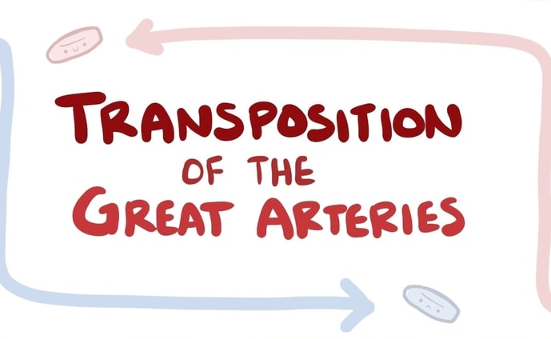
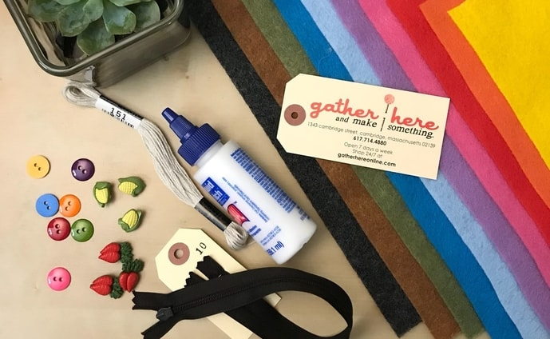

<section style="padding: 4em 0;">
  

    

      <a href="{{ site.url }}/registry" class="icon fa-gift" style="font-size: 10em;">
        Baby Registry
      </a>
      <a href="{{ site.url }}/registry">
        <h2>Baby Registry</h2>     
      </a>
      
Take a peek at my baby registry.

    

    

      <a href="{{ site.url }}/wall" class="icon fa-book" style="font-size: 10em;">
        Baby Wall
      </a>
      <a href="{{ site.url }}/wall">
        <h2>Baby Wall</h2>     
      </a>
      

        Post something on my baby wall.
      

    

  

</section>

<section>
	<header class="major">
		<h2>My Stories</h2>
	</header>
	

		<article>
			
			<h3>Transposition of The Great Arteries (TGA)</h3>
			

			  The day I found out that I had Transposition of The Great Arteries (TGA).
      

			<ul class="actions">
				<li><a href="{{ site.url }}/blog/transposition-of-the-great-arteries" class="button">Read More</a></li>
			</ul>
		</article>
		<article>
			
			<h3>MRI Study</h3>
			

			  My first MRI Experience at 27 weeks.
      

			<ul class="actions">
				<li><a href="{{ site.url }}/blog/mri-study" class="button">Read More</a></li>
			</ul>
		</article>
		<article>
      
      <h3>Baby Prep</h3>
      

        Preparation before <i>"Hello World!"</i>
      

      <ul class="actions">
        <li><a href="{{ site.url }}/blog/baby-prep" class="button">Read More</a></li>
      </ul>
    </article>
	

</section>
